# Hi there, I'm danhnguyenthanh260! 👋

<!-- Premium Flight Journey Animated SVG Banner using pure Markdown -->

  <strong>A passionate developer crafting beautiful, interactive web experiences.</strong>

  
  

---

### 🚀 About Me
- 💻 **Core focus:** Building interactive interfaces, animations, and robust web architectures.
- 🎨 **Aesthetics lover:** Passionate about micro-interactions, responsive grids, and visual excellence (inspired by [dei8](https://github.com/danhnguyenthanh260/dei8)).
- 📚 **Currently learning:** Advanced frontend animations, WebGL, and scalable systems.
- ⚡ **Fun fact:** I believe that if a UI doesn't feel alive, it's not finished!

---

### 🛠️ Languages & Tools

  <!-- Frontend -->
  
  
  
  
  
  <!-- Backend & DB -->
  
  
  
  <!-- Tools -->
  
  

---

### 📊 GitHub Stats & Contributions

<!-- Stats Cards using pure Markdown to bypass HTML parsing constraints. Xếp liền nhau để hiển thị ngang hàng trên Desktop. -->
 

 

---

### 📬 Connect with Me

  
  

---

  <i>This profile is animated with 💛 using custom CSS SVG technologies.</i>

